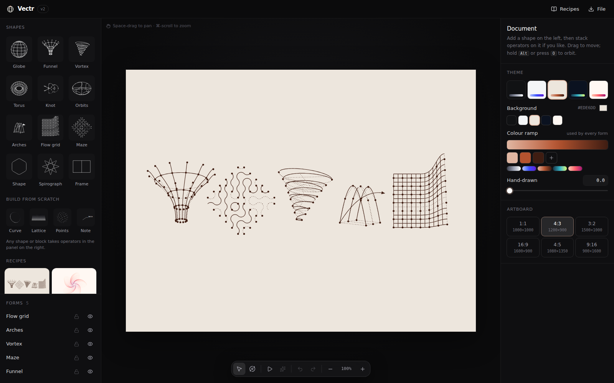

# Vectr

Generative vector shapes without the pen tool. Pick a generator, turn a few dials,
orbit it in 3D, export clean SVG.



## What it does

- **12 parametric generators**: Globe, Funnel (surface of revolution), Vortex (helix),
  Torus, Knot, Orbits (annotated rings), Arches, Flow grid (bend, fan, twist, wave,
  ripple, pinch, bulge), Maze (Truchet tiles), Shape (rounded polygon, star, squircle,
  flower, blob), Spirograph and Figure frame.
- **Real 3D with a hidden-line style**: lines facing away from you can be drawn dotted,
  dashed, faded, solid or hidden, the way technical illustrations do it.
- **Nodes and labels** for the "diagram" look: dots at intersections, figure captions.
- **Themes**: Paper, Chalk (with a hand-drawn displacement), Mono, Blueprint, Ember.
- **Export**: SVG download, SVG to clipboard (paste into Figma), 2× PNG, project JSON.
- **Open and share**: open a project file (`⌘O` or drag and drop), or copy a share link
  that encodes the whole design in the URL, with no server involved.
- Undo and redo, autosave to localStorage, spin animation, and a responsive layout.

## Shortcuts

| Key | Action |
| --- | --- |
| `V` / `O` | Move tool / Orbit tool (or hold `Alt` while dragging) |
| `Shift` + drag | Lock axis when moving; snap to 15° when orbiting |
| `R` | Randomize the selected shape |
| `P` | Play or pause spin |
| `⌘Z` / `⇧⌘Z` | Undo / redo |
| `⌘D` | Duplicate |
| `⌘S` | Download SVG |
| `⌘O` | Open a project file |
| Arrows | Nudge (hold `Shift` for 10px) |
| `Space` + drag, scroll | Pan |
| `⌘` + scroll, `0` | Zoom / fit |

## For agents and scripts

### MCP server (Claude and other agents)

[`packages/mcp`](packages/mcp) is an MCP server. Run `npm run mcp` once, then start
Claude Code in this repo; `.mcp.json` registers it. Ask for something like *"make a
chalk poster with a globe and a twisted torus in a figure frame"* and Claude will build
it, check the previews, and give you a link that opens it here. See
[packages/mcp/README.md](packages/mcp/README.md) for Claude Desktop setup and the tool list.

### Library and CLI

The engine lives in [`packages/core`](packages/core) (`@vectr/core`) and has no UI, so
scripts and agents run the same code the app does. A design is plain JSON, and
everything except each layer's `type` is optional:

```bash
npm run build -w @vectr/core
echo '{"theme":"chalk","layers":[{"type":"sphere","rx":15,"params":{"rings":3}}]}' \
  | npm run -s vectr -- render - -o globe.svg     # SVG file
npm run -s vectr -- link design.json               # link that opens it in the app
npm run -s vectr -- generators                     # every shape type and param, as JSON
```

Bad values are clamped or dropped, never fatal, and each fix is reported
(`warning: layers[0] (grid): "rows" clamped to 0–40`) so an agent can correct itself.
See [packages/core/README.md](packages/core/README.md) for the API.

## Develop

```bash
npm install
npm run dev      # http://localhost:5173
npm test         # geometry + export tests
npm run build
```

## Architecture

```
packages/core/src/
  generators/   Pure functions: params → 3D polylines (+ normals), nodes, labels
  render.ts     Rotate → project → split each line into front/back runs → path data
  svg.ts        Path data → SVG markup (used by the canvas and every export)
  schema.ts     Validate and normalise untrusted designs; generator catalogue
  share.ts      Share-link encoding (compact JSON → deflate → base64url)
  cli.ts        The `vectr` command
packages/mcp/src/
  designs.ts    In-memory design sessions; every change is validated by parseDoc
  server.ts     MCP tools (create, update, preview, export…)
  files.ts      File access confined to VECTR_ALLOWED_DIRS
src/            The React app: canvas, inspector, library, store (undo + autosave)
```

The app compiles `@vectr/core` from source through a Vite alias, so engine edits
hot-reload. To add a generator, write one `Generator` object (a param schema plus
`build()`) and register it in `packages/core/src/generators/index.ts`. The inspector UI is built from the schema,
so you don't need to write any UI code for it.
